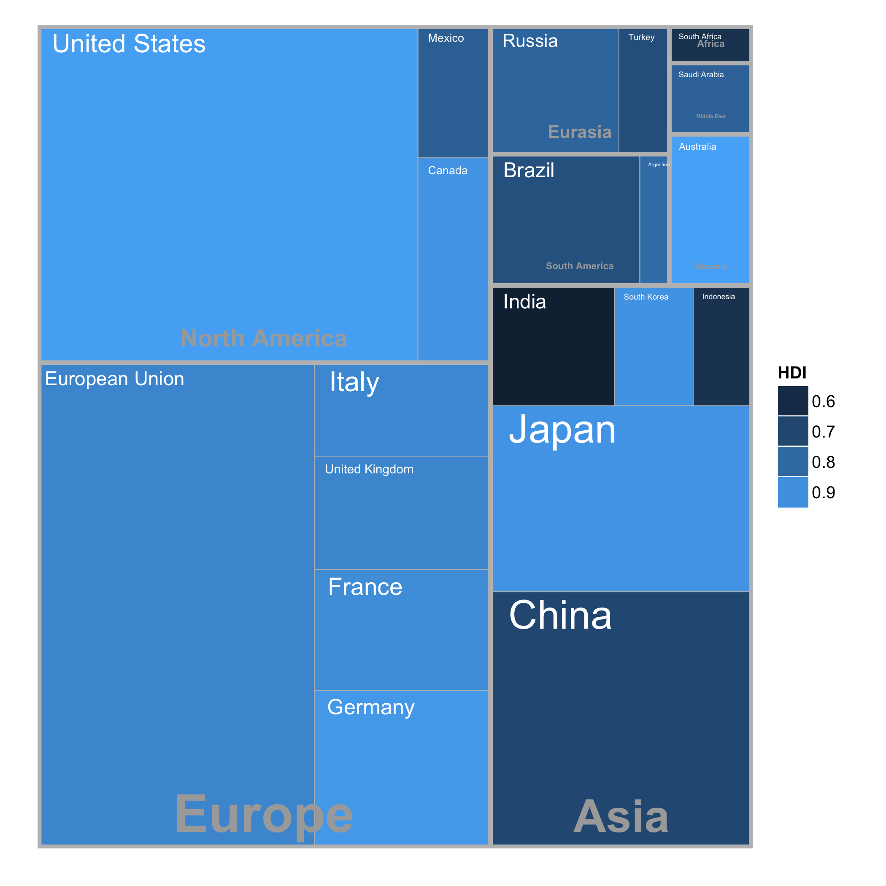
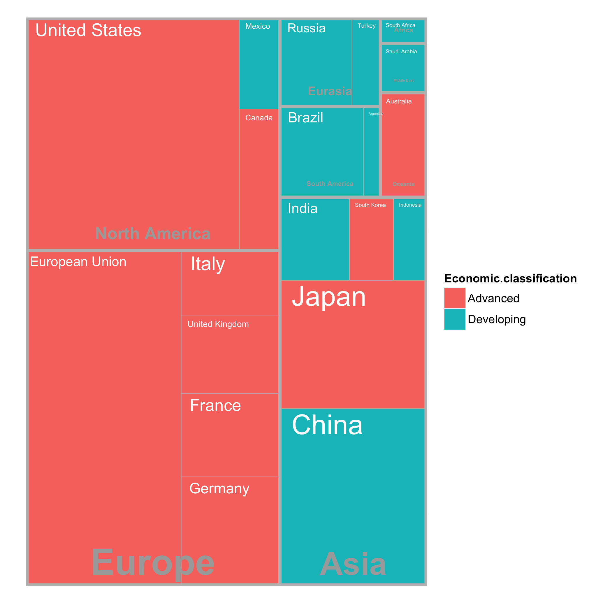
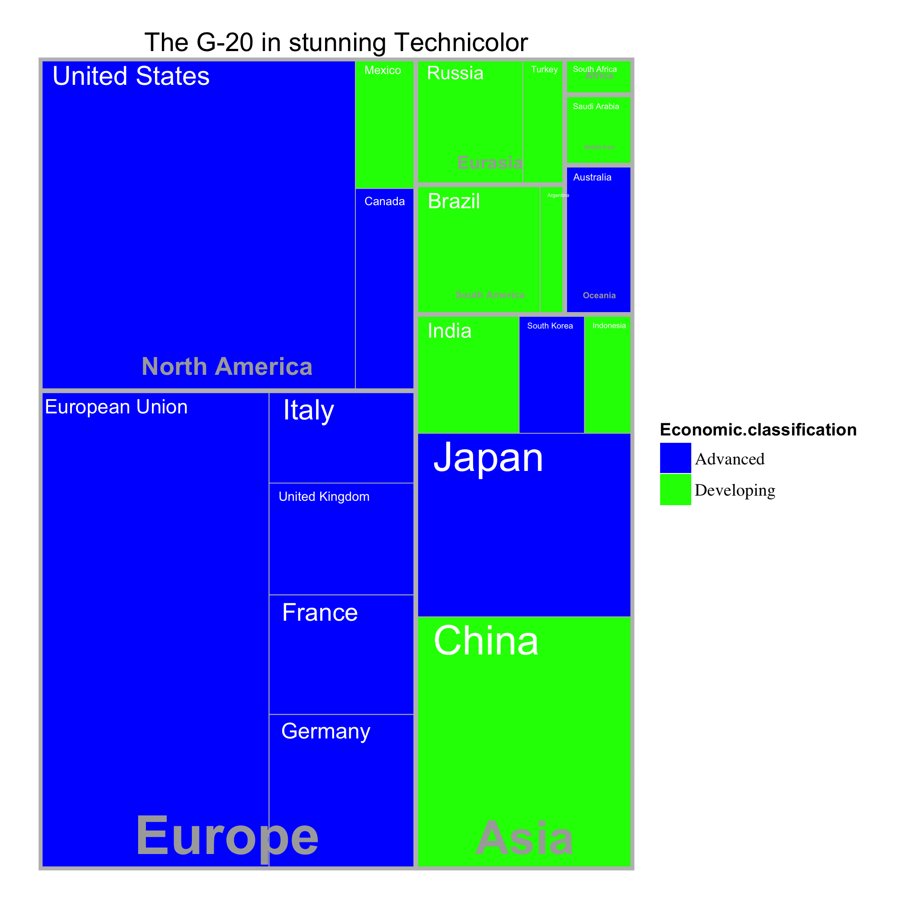

Treemapify makes it easier to draw treemaps with R and ggplot2.

#Walkthrough

##Installing dependancies, sourcing treemapify

- Install ggplot2, plyr and devtools if you don't have them already.

```R
> install.packages("ggplot2")
> install.packages("plyr")
> install.packages("devtools")
```

- Source the treemapify functions.

```R
> library(devtools)
> source_url("https://raw.github.com/wilkox/treemapify/master/treemapify.R")
```

##Some example data

For any treemap, you'll need a data frame containing at least the following columns:
  - A numeric column, which will determine the area of each treemap rectangle; and
  - Another numeric column, which will determine the fill colour of each treemap rectangle.

For this example, we'll also use a couple of optional columns:
  - A factor column, containing the labels for each rectangle; and
  - A factor column, containg group names to group the rectangles.

Let's plot some economic data for the G-20 group of major world economies ().

```R
> source_url("https://raw.github.com/wilkox/treemapify/master/examples/G20.R")
> G20
	Region         Country Trade.mil.USD Nom.GDP.mil.USD   HDI Population
1         Africa    South Africa        208000          384315 0.629   53000000
2  North America   United States       3969000        15684750 0.937  316173000
3  North America          Canada        962600         1819081 0.911   34088000
4  North America          Mexico        756800         1177116 0.775  112211789
5  South America          Brazil        494800         2395968 0.730  201032714
6  South America       Argentina        152690          474954 0.811   40117096
7           Asia           China       3801000         8227037 0.699 1339724852
8           Asia           Japan       1649800         5963969 0.912  127390000
9           Asia     South Korea       1068700         1155872 0.909   50004441
10          Asia           India        809400         1824832 0.554 1210193422
11          Asia       Indonesia        384100          878198 0.629  237556363
12       Eurasia          Russia        900600         2021960 0.788  143400000
13       Eurasia          Turkey        370800          794468 0.722   72561312
14        Europe  European Union       4567000        16414483 0.876  501259840
15        Europe         Germany       2768000         3400579 0.920   81757600
16        Europe          France       1226400         2608699 0.893   65447374
17        Europe  United Kingdom       1127000         2440505 0.875   62041708
18        Europe           Italy        953000         2014079 0.881   60325805
19   Middle East    Saudi Arabia        518300          727307 0.782   27123977
20       Oceania       Australia        522000         1541797 0.938   22328632
	Economic.classification
1               Developing
2                 Advanced
3                 Advanced
4               Developing
5               Developing
6               Developing
7               Developing
8                 Advanced
9                 Advanced
10              Developing
11              Developing
12              Developing
13              Developing
14                Advanced
15                Advanced
16                Advanced
17                Advanced
18                Advanced
19              Developing
20                Advanced
```

##The `treemapify` function

The `treemapify` function takes a data frame and generates coordinates for a treemap where each observation is represented by a rectangle. In this example, each observation is a country; the rectangle's area will be mapped to the country's nominal GDP, while the fill colour will be mapped to the Human Development Index (HDI). We'll also group the countries by region.

```R
> treeMapCoordinates <- treemapify(G20, area="Nom.GDP.mil.USD", fill="HDI", label="Country", group="Region")
> treeMapCoordinates
  fill           label     xmin      xmax     ymin      ymax         group
1  0.876  European Union  0.00000  38.66972  0.00000  58.99641        Europe
2  0.920         Germany 38.66972  63.32079  0.00000  19.17284        Europe
3  0.893          France 38.66972  63.32079 19.17284  33.88097        Europe
4  0.875  United Kingdom 38.66972  63.32079 33.88097  47.64081        Europe
5  0.881           Italy 38.66972  63.32079 47.64081  58.99641        Europe
6  0.937   United States  0.00000  53.16491 58.99641 100.00000 North America
7  0.911          Canada 53.16491  63.32079 58.99641  83.89092 North America
8  0.775          Mexico 53.16491  63.32079 83.89092 100.00000 North America
9  0.699           China 63.32079 100.00000  0.00000  31.17403          Asia
10 0.912           Japan 63.32079 100.00000 31.17403  53.77280          Asia
11 0.554           India 63.32079  80.66598 53.77280  68.39502          Asia
12 0.909     South Korea 80.66598  91.65265 53.77280  68.39502          Asia
13 0.629       Indonesia 91.65265 100.00000 53.77280  68.39502          Asia
14 0.730          Brazil 63.32079  84.19372 68.39502  84.34892 South America
15 0.811       Argentina 84.19372  88.33138 68.39502  84.34892 South America
16 0.788          Russia 63.32079  81.27630 84.34892 100.00000       Eurasia
17 0.722          Turkey 81.27630  88.33138 84.34892 100.00000       Eurasia
18 0.938       Australia 88.33138 100.00000 68.39502  86.75942       Oceania
19 0.782    Saudi Arabia 88.33138 100.00000 86.75942  95.42241   Middle East
20 0.629    South Africa 88.33138 100.00000 95.42241 100.00000        Africa
```

The "xmin", "xmax", "ymin" and "ymax" columns give the boundaries of each rectangle.

For publication-quality graphics, it's recommended that you stop at this point and use the coordinates provided to draw your own plot with custom parameters. For quick-and-dirty exploratory graphics, however, treemapify provides an additional function to draw the treemap with ggplot2.

##The `ggplotify` function

As the name suggests, this function takes a data frame of treemap coordinates produced by `treemapify` and produces a ggplot object containing a graphical layout of the treemap.

```R
> treeMapPlot <- ggplotify(treeMapCoordinates)
> print(treeMapPlot)
```



The function will try to scale labels to fit each rectangle. It's not perfect.

Because ggplot is clever, it will automatically figure out whether to use a discrete or continuous fill scale:

```R
> treeMapCoordinates <- treemapify(G20, area="Nom.GDP.mil.USD", fill="Economic.classification", label="Country", group="Region")
> treeMapPlot <- ggplotify(treeMapCoordinates)
> print(treeMapPlot)
```



And because it's ggplot, you can also add custom scales and other tweaks.

```R
> treeMapPlot <- treeMapPlot + scale_fill_manual(values=c("blue", "green"))
> treeMapPlot <- treeMapPlot + theme(legend.text = element_text(family="serif"))
> treeMapPlot <- treeMapPlot + ggtitle("The G-20 in stunning TechniColor")
> print(treeMapPlot)
```



For full control over the graphic output, you really should build the ggplot object yourself from the output of `treemapify`.

#Full function details

##`treemapify`

Mandatory arguments:

- **data frame**: data frame containing data to be mapped.
- **area=<column>**: string naming column in data frame to be mapped to area.
- **fill=<column>**: string naming column in data frame to be mapped to fill.

Optional arguments:

- **group=<column>**: string naming column in data frame by which observations should be grouped. Must be a factor.
- **label=<column>**: string naming column in data frame containing observation labels. Must be a factor.
- **xlim=<vector>, ylim=<vector>**: vectors with two elements specifying the x and y limits in which the plot should be constructed (defaults to a 100 * 100 plot).

Output: a dataframe containing the fill aesthetic, xmin, xmax, ymin and ymax for each observation, and (optionally) group and label factors.

##`ggplotify`

Mandatory argument: a data frame output by `treemapify`.

Optional argument: **label.groups=<TRUE|FALSE>**, a booleen specifying whether to draw group labels. Defaults to true if a group aesthetic was supplied to `treemapify`.

Output: a ggplot object. Can be modified with additional scales, geoms etc.

#Credit

`treemapify` uses the [Squarified Treemap](http://citeseerx.ist.psu.edu/viewdoc/summary?doi=10.1.1.36.6685) algorithm of Mark Bruls, Kees Huizing and Jarke van Wijk.

#G20 Data
The G20 dataset is from the Wikipedia article [G-20 major economies](http://en.wikipedia.org/wiki/G-20_major_economies), which is released under the [Creative Commons Attribution-Share-Alike License 3.0](Creative Commons Attribution-Share-Alike License 3.0).
